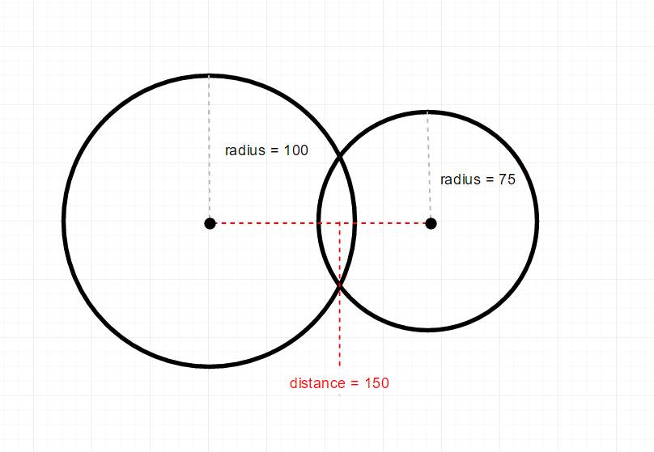

# Fuerzas, aceleración y colisiones

> Una *fuerza* aplicada a un objeto producirá una *aceleración* la cual a su vez
> modificará su velocidad.

Las fuerzas pueden representarse como vectores. Por ejemplo, la fuerza de
*gravedad* es una fuerza aplicada verticalmente, mientras que la *fricción* (o
*tracción*) sobre una superficie se aplica comúnmente a la velocidad horizontal.

Es común en animaciones simples en lugar de usar los vectores de fuerzas
directamente se usen *factores de aceleración*. Esto es común para simular
propiedades de objetos como la fricción sobre superficies y *elasticidad*
(cuánto *rebota* en una colisión).

-------------------------------------------------------------------------------

## Efectos de gravedad, fricción y elasticidad

La *gravedad* es una fuerza descente. Aplicarla simplemente consiste en sumarle el
valor de la gravedad al componente *y* del vector velocidad.

La *elasticidad* o *factor de rebote (bouncing)* se multiplica al componente *x*
o *y* (según corresponda) de la velocidad luego de una colisión.

La *fricción* o *tracción* representa una fuerza que *frena* el objeto en su
dirección horizontal (multiplica al componente *x* de la velocidad).
En éste ejemplo lo aplicaremos en cada colisión con el piso.

El siguiente [sketch](https://editor.p5js.org/marroyo/sketches/AB6ic6ELu) aplica
estas ideas en la función `actualizarVelocidad(obj)` en el archivo
`dinamica.js`.

<iframe src="https://editor.p5js.org/marroyo/sketches/AB6ic6ELu"
        width="600" height="600"></iframe>

Podemos experimentar cambiando los valores de aceleración, elasticidad y tracción.

-------------------------------------------------------------------------------

## Colisiones entre objetos

Es común que en animaciones los objetos colisionen entre sí. Hay que resolver
dos problemas:

1. Detectar las colisiones entre los objetos (ej: entre círculos)
2. Calcular las reacciones de cada uno, es decir, los vectores velocidad
   resultantes de la colisión.

> Para detectar si dos círculos *colisionan* basta con detectar si se
> *superponen*. 
> Los círculos $c_1$ y $c_2$ se superponen si la distancia entre
> sus centros es menor o igual a la suma de sus radios, como se muestra en las
> siguientes figuras.

-------------------------------------------------------------------------------

## Reacción ante una colisión

En el modelo de *choque elástico* no hay pérdida de energía en el sistema.

Desde las ecuaciones de Newton de la conservación de la energía y del momento
lineal, teniendo en cuenta la *velocidad* y la *masa* de cada objeto, se pueden
derivar las siguientes ecuaciones para el cálculo de las nuevas velocidades
luego de una colisión (ver [choque
elástico](https://es.wikipedia.org/wiki/Choque_el%C3%A1stico)) en la Wikipedia:

$$v_1' = \frac{v_1 \times (m_1-m_2) + 2 \times (v_2 \times m_2)}{m_1 + m_2}$$

y

$$v_2' = \frac{v_2 \times (m_2-m_1) + 2 \times (v_1 \times m_1)}{m_1 + m_2}$$

donde $v_1'$ y $v_2'$ son las nuevas velocidades de un objeto con velocidad
$v_1$ y masa $m_1$ y otro con velocidad $v_2$ y masa $m_2$.

En el siguiente [sketch](https://editor.p5js.org/marroyo/sketches/iuq-RAfVd) se
incluye un nuevo archivo (`colisiones.js`) con funciones que implementan el
procesamiento de colisiones entre círculos.

La función `actualizarVelocidad(obj)` ahora invoca a la función
`procesarColisiones(obj)` (definida en el archivo `colisiones.js`) que detecta
colisiones entre círculos y hace que éstos reaccionen en base a su masa y
velocidad.

En éste ejemplo hicimos que la masa de cada círculo es proporcional a su radio.
Ver la función `circulo()` en `utils.js`.

La función `procesarColisiones(obj)` determina si `obj` colisiona con algún otro
objeto en cuyo caso procesa la reacción usando las ecuaciones dadas.

También agregamos un efecto de sonido en cada colisión (`sonido.play()`), para
lo cual hay que *precargar* el archivo de sonido *hit.mp3*.

<iframe src="https://editor.p5js.org/marroyo/sketches/iuq-RAfVd"
        width="600" height="600">
</iframe>