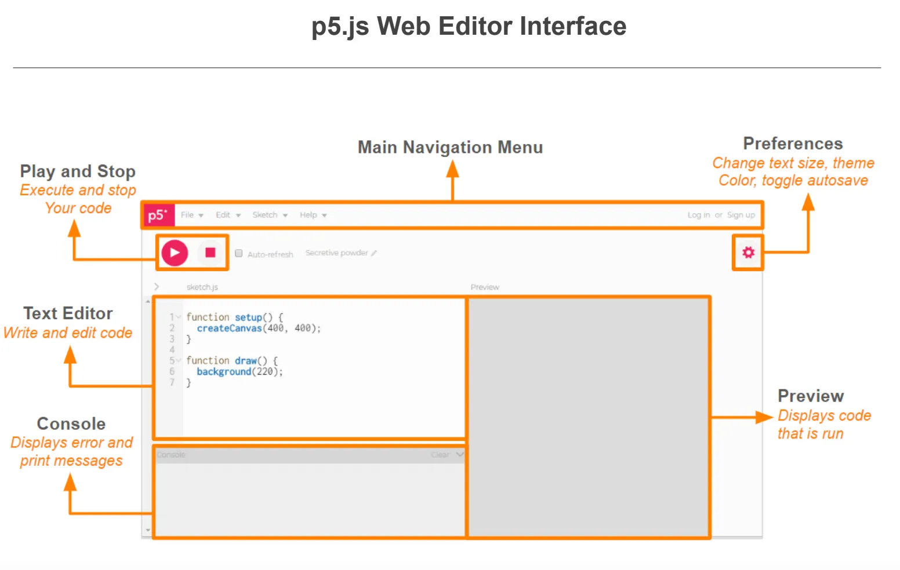

# Comencemos

## El editor p5 online

Así se ve el editor online que nos provee [p5.js editor](https://editor.p5js.org).
Si, lo que ves más abajo es un editor de p5 totalmente funcional embebido en
esta página, más adelante hablaremos de como hacer esto, por ahora puedes usarlo
así o puedes abrir una nueva ventana e ir al sitio de *p5.js*.

La siguiente figura muestra los diferentes elementos del editor en línea:



Debajo está el editor embebido en éste documento, en el cual podemos trabajar
directamente o ustedes pueden abrirlo en
[otra ventana de su navegador](https://editor.p5js.org/). Ante la pregunta de
usar *cookies*, pulsar en el botón `Allow Essential` (permitir sólo lo
esencial). Se puede seleccionar el idioma español en el menú de arriba a la
derecha.

<iframe src="https://editor.p5js.org/"  width="600" height="600"></iframe>

-------------------------------------------------------------------------------

### Usando el p5.js Web Editor:

1. Ingresar con una cuenta en el editor web. Podemos hacerlo con nuestra cuenta
   de gmail y otras, o crear un usuario en el sitio.
2. Nombrar el proyecto clickeando el icono del lapiz.
3. En el menú file, guardar (save)
4. Confirmar que su proyecto ha sido guardado navegando la galería de sketches.


-------------------------------------------------------------------------------

### El código inicial

Cada vez que creamos un nuevo proyecto (o *sketch*), el sistema crea tres
archivos: `index.html`, `style.css`, y `sketch.js`.

El archivo `index.html` es página web que contiene la interfaz gráfica de la
aplicación y incluye la hoja de estilos `style.css` y el código Javascript
`sketch.js`. El archivo `sketch.js` contiene inicialmente dos funciones: `setup()` y
`draw()`.

```js
function setup() {
  createCanvas(400, 400);
}

function draw() {
  background(220);
}
```

Al iniciarse la aplicación, *p5.js* ejecutará `setup()` por única vez al
comienzo, luego de crear algunos objetos internos. Podemos usar esta función
para definir configuraciones o valores iniciales de nuestro proyecto, como por
ejemplo crear el *canvas* (área de dibujo) en la página web.

!> ***Atención***: Todas las funciones de *p5.js* estarán disponibles en
al ejecutarse `setup()`. Intentar usarlas antes generará errores.

## El canvas

El *canvas* es un área de dibujo basado en una *matriz de píxeles*: Arreglo de
puntos organizados en filas y columnas.


El código de *p5.js* invocará a la función `draw()` repetidamente unas 60 veces
por segundo, permitiéndonos programar animaciones fácilmente.

Si ejecutamos el programa, visualizaremos el canvas con un fondo gris suave.

Si no estamos interesados en hacer una animación, simplemente podemos borrar la
función `draw()` y hacer todo en `setup()` desde donde podemos invocar a
nuestras propias funciones definidas como en el siguiente ejemplo:

```js
function setup() {
  createCanvas(400, 400);
  background(220);
  mostrarTexto("Hola p5.js");
}

function mostrarTexto(texto) {
  // muestra el texto desde la coordenada (50,50)
  text(texto, 50, 50);
}
```

-------------------------------------------------------------------------------

## Nuestra primera animación

Para confirmar que el sistema ejecuta la función `draw()` repetidamente, podemos
ir cambiando el color de fondo del canvas de la siguiente manera:

```js
// color de fondo del canvas (negro)
let fondoCanvas = 0;

function setup() {
  createCanvas(400, 400);
}

// cambia el fondo con valores [0..255]
function draw() {
  background(fondoCanvas);
  fondoCanvas = (fondoCanvas + 1) % 256;
}
```

Copiar y pegar el código anterior en el editor de arriba, luego ejecutar el
programa.

-------------------------------------------------------------------------------

## Dibujando en el canvas

*P5.js* contiene un conjunto de funciones para dibujar figuras en el canvas.
El siguiente programa dibuja un círculo con fondo rojo y un rectángulo
verde.

```js
function setup() {
  createCanvas(400, 400);
}

function rojo() {
  return color(255, 0, 0);
}

function verde() {
  return color(0, 255, 0);
}

function draw() {
  background(220);
  // círculo rojo con centro (80,110), diámetro: 50
  fill(rojo());
  circle(80, 110, 50);

  // rectángulo verde en (100,120), ancho: 80, alto: 65
  fill(verde());
  rect(100, 200, 80, 65);
}
```

Para ver el conjunto de funciones y estructuras de datos que contiene *p5.js* ir
a la sección [Referencia](https://p5js.org/es/reference/).